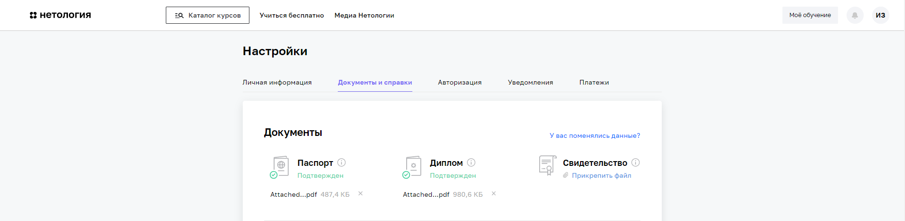

# Задание на допуск к Дипломной работе
 
---

1. Получилось ли у вас загрузить в личный кабинет документы, подтверждающие личность, и диплом о высшем или среднем специальном образовании? 
    
   а) **Да**
    
    
   
    
    
2. Нужна ли вам справка об обучении после сдачи дипломной работы? Справка выдаётся всем студентам, в том числе тем, у кого нет диплома о высшем или среднем специальном образовании. 
    
   а) **Да**
    
    

3. Выполнен ли вами необходимый минимум заданий на каждом модуле профессии для допуска к дипломной работе? 
    
   а) **Да**

   

